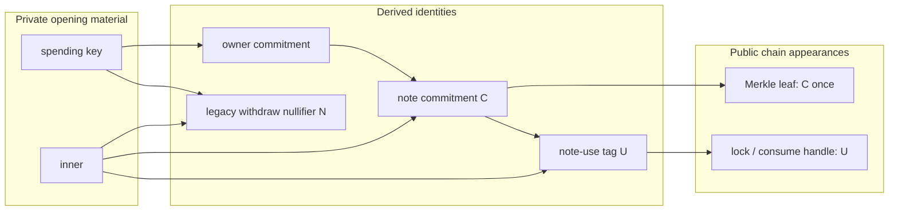
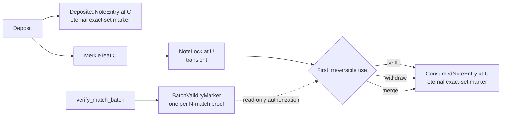

# Privacy architecture coherence and remediation plan

**Date:** 2026-08-25

**Kind:** consolidated design finding, decision record, and implementation plan

**Status:** Phase 0 evidence and decisions complete; production implementation
has not started

**Mainnet effect:** circuit freeze, external circuit review, and Phase-2 ceremony
remain blocked until every mandatory item in this plan is closed

This is the canonical record for the privacy-architecture coherence pass. It
supersedes and replaces the three exploratory reviews that produced it:

- `docs/privacy-architecture-coherence.md`
- `docs/privacy-architecture-coherence-review-2.md`
- `docs/privacy-inner-derivation-review.md`

Those files were working papers with overlapping and occasionally conflicting
recommendations. They are intentionally removed rather than retained as three
sources of truth. Audit reports under `audits/` remain immutable and are not
superseded by this document.

Implementation state is tracked in
[`privacy-architecture-remediation-tracker.md`](privacy-architecture-remediation-tracker.md).
Phase 0 measurements, fixed vectors, account-reader inventory, and the frozen
design decisions live in
[`privacy-architecture-phase0-report.md`](privacy-architecture-phase0-report.md).
The proposed machine-readable domain allocation is
[`privacy-domain-registry.proposed.json`](privacy-domain-registry.proposed.json).
Its validation contract is
[`privacy-domain-registry.schema.json`](privacy-domain-registry.schema.json).
The reproducible frozen formula vectors are
[`privacy-architecture-phase0-vectors.json`](privacy-architecture-phase0-vectors.json).

---

## 0. Executive decision

Darknyx does **not** need a different shielded-pool architecture. The central
note construction has converged on the right minimum for this product:

```text
commitment C = H(mint, amount, owner, inner)
use tag U    = H(C, inner)
```

`C` is the one-time public Merkle leaf. `U` is the later public lock and
consume handle. The two values cannot be collapsed without either republishing
the leaf, unbinding note value, or giving the TEE the user's spending secret.

The architecture nevertheless needs one deliberate pre-audit cutover. The
successive fixes left four kinds of remediable residue:

1. **Two output-inner constructions undermine tag unlinkability.** Fee-note
   inners and merge-output inners are derived from public commitments. This can
   reconstruct a note's lineage even though `U` itself is well designed.
2. **One complete identity subsystem has no consumer.** Wallet registration
   publishes a permanent Solana-address-to-identity edge and carries a circuit,
   VK, PDA, event, key derivations, and cross-language parity surface that no
   authorization or product flow uses.
3. **Replay accounts carry unnecessary data.** The existence and seeds of the
   deposit and consume guards are load-bearing; most bytes stored inside them
   are not. `NoteLock` likewise duplicates its seed and stores an unused signer.
4. **Several client/circuit conventions are more complicated than the security
   model requires.** These include a counter-shaped deposit nonce API, a dead
   withdraw nullifier, two seed-derived values acting as one owner credential,
   an owner value repeated inside the deposit inner, and an unwired BN254
   compliance-viewing hierarchy.

The recommendation is therefore:

> Preserve `C`, `U`, private per-note inners, deterministic continuation
> outputs, exact deposit/consume existence guards, and separate transient
> locks. Remove the unused identity subsystem, make every descendant inner
> contain high-entropy secret material, compact account payloads, and carry the
> remaining circuit simplifications in one flag-day cutover before audit and
> ceremony.

---

## 1. Review question and non-negotiable privacy bar

The exercise asked whether Darknyx could provide the same or stronger privacy
with fewer cryptographic objects, accounts, bytes, compute units, cross-language
contracts, and operational failure modes.

The resulting design must preserve all of the following:

1. Mint and gross deposit amount remain public at the transparent deposit
   boundary. The note owner and inner remain private.
2. A note commitment appears as a Merkle leaf exactly once. Later locks,
   settlements, merges, and withdrawals do not republish or otherwise cheaply
   reconstruct that leaf's identity.
3. Trade amounts, clearing prices, change amounts, and fee amounts remain absent
   from the public settlement payload and events. Conservation and exact fees
   remain proof-backed.
4. Learning a wallet-wide owner commitment must not reveal all deposit inners or
   note-use tags. A per-note high-entropy secret remains load-bearing.
5. Match, change, merge, and fee output inners are protocol-determined. A caller
   cannot select arbitrary randomness to create collisions or break recovery.
6. Withdraw, merge, and settlement share one irreversible consume-once
   namespace.
7. Users recover deposit, trade, change, continuation, and merge openings from
   seed plus chain without a custodial opening store.
8. A compromised TEE cannot prove a fake input, inflate a note, redirect value,
   evade exact fees, or consume the same note twice. TEE-trusted price fairness
   remains the already accepted boundary.
9. Per-match fees remain issued atomically by the Tx D that consumes that
   match's inputs. Batch-level fee aggregation must not return.
10. No proposal may silently trade the current K-shard concurrency model for a
    globally serialized tree or state account.

Properties deliberately outside this cutover remain outside it: hiding gross
deposit or withdrawal amounts, replacing the TEE fairness boundary, browser
transport decisions, network-traffic analysis, and migrating the replay set to
a new compressed-account runtime.

---

## 2. As-built object graph

### 2.1 Note identity and consumption

```text
owner = Poseidon3(DOMAIN_OWNER=1, spending_key, r_owner)
C     = Poseidon6(DOMAIN_NOTE=2, mint_lo, mint_hi, amount, owner, inner)
U     = Poseidon3(DOMAIN_NOTE_USE=29, C, inner)
N     = Poseidon3(DOMAIN_NULL=3, spending_key, inner)  // legacy withdraw signal
```

Who sees each object:

| Object | Client | TEE | Chain | Role |
|---|---:|---:|---:|---|
| spending key | yes | no | no | proves ownership for client-side proofs |
| owner commitment | yes | yes during order intake | no for user notes | wallet-wide owner field |
| inner | yes | yes for active orders | no | opening entropy and lineage secret |
| commitment `C` | yes | yes | once as leaf | note identity in the tree |
| use tag `U` | yes | yes | lock/consume paths | unlinkable public handle |
| legacy nullifier `N` | yes | no | withdrawal only | no state or replay role remains |

Two public 32-byte identities are load-bearing. PDA seeds are public. Using `C`
as the consume handle republishes the Merkle leaf. Using `H(inner)` alone fails
to bind mint, amount, and owner in circuits where `C` is private. A classic
spend nullifier derived from the spending key cannot be produced by the TEE,
which correctly does not possess that key.



### 2.2 Current inner derivations

| Note kind | Current construction | Secret from an observer? | Finding |
|---|---|---:|---|
| deposit | `H(27, owner, public_nonce, note_secret)` | yes | unnecessarily repeats owner |
| match trade/change | `H(24, input_inner, role)` | yes | retain |
| protocol fee | `H(25, input_C, role)` | **no** | PA-01 |
| merge output | `H(26, C0, C1, C2, C3, bitmap)` | **no** once inputs are identified | PA-02 |

The invariant is not that every preimage element must be private. Deposit
inners safely contain a public nonce. The actual rule is:

> Every derived output inner must contain at least one high-entropy value that
> remains unknown to a chain observer, while all public context needed for
> binding and recovery remains proof-constrained.

If an inner is computable from chain data, then `U = H(C, inner)` is computable
as soon as the output commitment is published. The tag construction remains
cryptographically correct but ceases to hide lineage.

### 2.3 Current account graph and rent

Approximate account data lengths include the Anchor discriminator. Confirm all
budget numbers with `solana rent <DATA>` before deployment.

| Account | Seed identity | Current bytes | Lifetime | Security role |
|---|---|---:|---|---|
| `WalletEntry` | user commitment + signer | 88 | eternal | none in current product |
| `DepositedNoteEntry` | commitment `C` | 56 | eternal | exact deposit-once existence guard |
| `ConsumedNoteEntry` | use tag `U` | 72 | eternal | shared consume-once existence guard |
| `NoteLock` | use tag `U` | 136 | transient | pins mint, order, and expiry before settle |
| `BatchValidityMarker` | batch root | 49 | transient | one verified proof authorizes N match leaves |

Current permanent rent per deposited note that is later consumed is roughly:

```text
DepositedNoteEntry  ≈ 0.00128064 SOL
ConsumedNoteEntry   ≈ 0.00139200 SOL
total               ≈ 0.00267264 SOL
```

One million deposited-then-consumed notes would therefore immobilize roughly
2,672.64 SOL in these two exact-set accounts. The accounts cannot simply close,
but their payloads can be reduced.



---

## 3. Consolidated findings

The future remediation tracker must use these IDs unchanged.

### PA-01 — fee inners can relink an input leaf to its settlement

**Severity:** High — privacy

**Status:** validated; benchmark and final recovery design required

**Mainnet:** blocking

Current construction:

```text
fee_inner = Poseidon3(25, input_commitment, role)
fee_C     = Poseidon6(2, mint_lo, mint_hi, fee_amount,
                         public_protocol_owner, fee_inner)
```

The input commitment is a historical public leaf. The mint, role, fee rate,
protocol owner commitment, and output fee commitment are public. For the first
trade from a public deposit of amount `A`, the only unknown is bounded by:

```text
0 <= fee_amount <= floor(A * fee_rate_bps / 10_000)
```

At 30 bps, a 20-USDC deposit in six-decimal atomic units yields at most 60,000
candidate fees. An observer can compute candidate fee commitments until one
matches the fee commitment in a Tx D payload.

A hit reveals:

- which historical input leaf participated in that settlement;
- which base/quote side it occupied;
- the exact fee; and
- the corresponding notional within approximately `10_000 / fee_rate_bps`
  atomic units, around 333 units at 30 bps.

This is not a generic Poseidon preimage attack. It is a dictionary over a small
integer with a public ceiling. It can directly defeat the deposit-to-settlement
unlinkability that note-use tags were introduced to provide.

#### Target construction

Use a governed, rotatable, independently backed-up protocol fee key:

```text
fee_key_binding = H(DOMAIN_FEE_KEY_BINDING, fee_key)

fee_inner_v2 = H(DOMAIN_FEE_INNER_V2,
                 fee_key,
                 consumed_use_tag,
                 role)
```

Use the **proof-bound consumed use tag**, not the hidden input commitment, as
the public context. The tag is already in Tx D and in the match leaf. This
means the protocol can rederive the inner from chain plus its fee key without
first rediscovering which commitment the tag hides.

`VaultConfig` stores only the binding and a monotonic fee-key epoch. The match
config digest binds both. MATCH_BATCH accepts the fee key as a private witness,
checks its binding once, and uses it for every active slot. Public Groth16 input
count remains two: `[batch_root, config_digest]`.

The fee key must be:

- sampled as a canonical BN254 scalar from a CSPRNG;
- controlled and backed up by the protocol, not generated ad hoc by the TEE;
- injected through encrypted deployment configuration;
- rotated only through a drain/pause/finalized-governance/resume procedure; and
- retained by epoch until every old fee note is recovered or spent.

A compromised enclave cannot substitute a junk key because the proof checks the
governed binding. A leaked epoch key reveals only that epoch's fee graph rather
than the protocol's full long-lived identity history.

The key recovers the fee inner, not the private fee amount. Phase 0 therefore
selected a fixed encrypted N=16 fee-amount bundle carried in the
TEE-authorized Tx B. Its explicit epoch plus XChaCha20-Poly1305 ciphertext adds
280 bytes to Tx B and leaves Tx D unchanged. Finalized Tx D commitments filter
failed slots during recovery. The exact layout, key lifecycle, AAD, projected
931-byte transaction, and failure behavior are frozen in the Phase 0 report.
Do not claim key-plus-chain fee recovery until the final serializer assertion
and loss/rotation recovery drills demonstrate both inner and amount recovery.

#### Required evidence

- A legacy-construction benchmark in hashes/second and wall time for realistic
  USDC/SOL deposit and order ranges.
- A PoC that links a known deposit commitment to its Tx D fee output.
- A negative version of the PoC showing the same observer cannot test
  candidates under v2 without the fee key.
- A positive protocol recovery test using the correct epoch key.
- A wrong-key and stale-epoch proof rejection test.
- MATCH_BATCH proving-time, witness-time, VK-size, verifier-CU, and Tx-size
  deltas.

### PA-02 — merge output inners contain no observer-secret input

**Severity:** High — privacy

**Status:** validated

**Mainnet:** blocking

Current construction:

```text
merge_inner = Poseidon6(26, C0, C1, C2, C3, active_bitmap)
```

All commitments are public Merkle leaves and the bitmap has four bits. The
merge instruction publishes input use tags rather than commitments, so an
unrelated observer is not always handed `C0..C3` directly. The exact attack is:

1. identify or enumerate plausible input leaves for the merge's public tags;
2. compute the candidate merge inner;
3. combine it with the public merge output commitment to compute its use tag;
4. compare that tag with a later lock, settle, merge, or withdrawal.

For a known depositor with a small set of public deposit leaves, K=2 auto-merge
is a small combination search. The attack is easiest early in the product when
candidate sets are smallest. If the exact inputs are already known, no search
remains.

#### Target construction

```text
merge_inner_v2 = Poseidon6(DOMAIN_MERGE_INNER_V2,
                           inner0, inner1, inner2, inner3,
                           active_bitmap)
```

Allocate a fresh domain. Do not reuse domain 26 with a new same-arity preimage
meaning.

VALID_MERGE already witnesses every input inner to recompute each input
commitment and use tag. This is a same-arity preimage substitution:

- no new public input;
- no new private signal;
- no wire-size increase;
- no weakened binding, because every input commitment and Merkle path remains
  independently constrained; and
- unchanged user recovery, because the owner already knows all input inners.

Cold recovery must resolve the public input tags to owned notes as it does now,
then feed those notes' inners rather than commitments into the derivation.

#### Required evidence

- A written legacy PoC over fixture or devnet data that computes the merged
  output's later use tag from candidate public leaves.
- A negative v2 PoC showing public commitments are insufficient.
- K=2 and K=4 circuit tests, Rust/TS parity, cold-recovery fixed-point tests,
  and merge-then-order end-to-end evidence.
- Mutation test: temporarily restore commitment-derived inners and confirm the
  negative privacy test fails.

### PA-03 — wallet registration is an unused public identity subsystem

**Severity:** Medium — privacy and architecture

**Status:** validated

**Mainnet:** blocking as dead circuit/audit surface

`VALID_WALLET_CREATE`, `WalletEntry`, and `user_commitment` are not used by
deposit, order intake, lock, settle, merge, withdrawal, or authorization. The
instruction's own security comment relies on the fact that no instruction reads
`WalletEntry`.

The subsystem includes:

- domain tags 10 through 14;
- seed-derived root, spending, and BN254 viewing branches plus `r0/r1/r2`;
- a Circom circuit, zkey, VK, on-chain verifier, and ceremony surface;
- the `create_wallet` instruction and an eternal user-paid PDA;
- a public event linking the registering Solana signer to a wallet-wide public
  identity;
- Rust/TS implementations, examples, builders, parsers, and parity tests; and
- browser/daemon proving and keystore residue.

It provides no current privacy, custody, or authorization invariant. If a
future product needs registered identity, the current proof is already
insufficient to authorize `wallet_entry.owner`; that feature would need a new
design anyway.

#### Required change

Delete the subsystem completely. Preserve the unrelated governance
`VaultConfig.root_key`. Preserve the live X25519 viewing-encryption key used for
fill recovery.

No tree reset is intrinsically required for this deletion because note and
settlement constructions do not depend on `user_commitment`. It should still
land before external audit so the auditor and ceremony never cover dead code.

### PA-04 — eternal replay markers store redundant payloads

**Severity:** Low security risk; High volume-cost impact

**Status:** validated, compatibility test required

**Mainnet:** pre-launch optimization

`DepositedNoteEntry` is seeded by `C` and `ConsumedNoteEntry` is seeded by `U`.
Production safety checks use account existence. Their stored commitment/tag,
slot, match ID, and bump fields have no production reader that contributes to
authorization, recovery, or replay safety.

Retain both exact existence sets but make each an eight-byte
discriminator-only Anchor account.

Estimated savings:

| Account | Current | Target | Saved data |
|---|---:|---:|---:|
| deposit marker | 56 B | 8 B | 48 B |
| consume marker | 72 B | 8 B | 64 B |
| combined permanent rent | ~0.00267264 SOL | ~0.00189312 SOL | ~0.00077952 SOL |

This is approximately a 29.2% reduction, or about 779.52 SOL per million
deposited-then-consumed notes under the current rent formula.

Do not replace them with zero-data untyped accounts merely to save the final
discriminator bytes. The Anchor discriminator preserves type-cosplay defense
and simpler auditing for a small marginal cost.

### PA-05 — `NoteLock` duplicates its seed and stores an unused signer

**Severity:** Low security risk; Medium transient-cost impact

**Status:** validated

**Mainnet:** pre-launch optimization

The lock's use tag is already its PDA seed. `locked_by` is written but not read
for settlement, release authority, or rent refund. Retain:

- `token_mint`, used for market/mint binding and continuation locks;
- `order_id`, compared with the signed settle payload;
- `expiry_slot`, used by settle, withdraw, merge, and release; and
- `bump`, used on the hot settle close path.

Remove the duplicated tag and `locked_by`. `release_lock` can emit the
instruction's seed argument rather than reading the tag from account data.

Expected layout: approximately 72 bytes including discriminator instead of
136, saving 64 bytes and about 0.00044544 SOL of transient rent per live lock.

Every raw expiry offset, SDK decoder, account-layout fixture, lock sweeper, and
litesvm seed helper must move atomically.

### PA-06 — the SDK exposes a counter-shaped deposit nonce footgun

**Severity:** Medium — user-funds recoverability

**Status:** validated; daemon already partially mitigates

**Mainnet:** blocking for public SDK

The SDK accepts `depositIndex: bigint` and deterministically derives the public
recovery nonce from it. A client that restores a seed but not its counter can
recreate an old commitment. The daemon avoids the sequential-counter failure by
choosing a random 64-bit value, but the raw SDK API still invites it.

A duplicate commitment does not let an attacker steal or make the vault
under-collateralized. It can move the user's tokens into a second deposit that
shares a consumed use tag and becomes unspendable. The exact deposit marker is
therefore user-protection defense in depth, not a protocol-solvency primitive.

#### Required change

- Replace `depositIndex` with an SDK-generated canonical random public nonce.
- Prefer 248 bits of direct entropy or rejection-sample a 32-byte value below
  the BN254 modulus; do not retain an unnecessarily narrow 64-bit space.
- Permit an explicit nonce only for controlled retry and test APIs.
- Bind the public nonce in VALID_DEPOSIT as today.
- Preserve the deposit marker.
- Add ambiguous-submission tests covering landed, not-landed, and exact-retry
  outcomes.

### PA-07 — VALID_SPEND publishes a dead second nullifier

**Severity:** Low — privacy and circuit complexity

**Status:** validated

**Mainnet:** include in mandatory circuit cutover

`N = H(spending_key, inner)` is a public VALID_SPEND signal and instruction
field, but no account or replay guard keys on it. `U` is already the canonical
shared consume nullifier across withdrawal, merge, and settlement.

Remove `N`, its public signal, instruction/event field, TS/Rust helper usage,
and dead state/error commentary. Decrease VALID_SPEND public inputs
accordingly. Reserve the old Anchor error-code slot instead of silently
renumbering every later `VaultError` unless an explicit major wire reset updates
all consumers.

No tree reset is required solely by this change, but it belongs in the combined
flag-day proof cutover.

### PA-08 — the owner credential carries two secrets from one compromise domain

**Severity:** Design simplification

**Status:** design frozen — adopt the single-secret owner v2 construction

**Mainnet:** decide before circuit freeze

Current owner construction hashes `spending_key` and `r_owner`. Both are
derived from the same master seed, held in the same keystore, and supplied by
the same prover. Consequently `r_owner` is not an operational second factor:
seed compromise reveals both.

Preferred target unless an actual split-custody product is committed:

```text
owner_v2 = Poseidon2(DOMAIN_OWNER_V2, spend_secret)
```

The hash remains essential: the TEE may learn `owner_v2` but must not learn the
withdrawal secret. A uniformly sampled 254-bit secret does not need a second
same-keystore value for entropy.

Keep the current two-input construction only if the implementation plan stores
the factors in genuinely independent security domains and documents recovery
and failure semantics. A hypothetical future separation is not enough reason to
retain the current witness and keystore surface.

This change invalidates every note because owner is part of `C`; it therefore
must happen, if chosen, in the pre-launch flag-day reset.

### PA-09 — deposit inner repeats owner and recovery is a client invariant

**Severity:** Design simplification and documentation correctness

**Status:** design frozen — adopt nonce-plus-note-secret deposit inner v2

**Mainnet:** decide before circuit freeze

Current deposit inner:

```text
inner = H(27, owner, recovery_nonce, note_secret)
note_secret = KDF(master_seed, recovery_nonce)
```

`C` already binds owner, while the per-note secret is what prevents a leaked
wallet-wide owner commitment from exposing every deposit tag. Preferred target:

```text
inner_v2 = H(DOMAIN_DEPOSIT_INNER_V2, recovery_nonce, note_secret)
```

Allocate a fresh domain rather than reusing 27 with changed semantics.

The circuit does **not** and should not attempt to implement the SHAKE KDF. It
accepts `note_secret` as a private witness and proves only the Poseidon
relationship. Thus seed recovery is a canonical-client invariant, not a
property guaranteed for every arbitrary valid proof. A custom prover can create
a valid but unrecoverable note.

Do not add SHAKE to the circuit. Instead make note construction atomic in the
SDK, keep raw `note_secret` out of normal APIs, and require a recovery
round-trip test from seed plus serialized chain data.

### PA-10 — the active key model includes an unwired BN254 viewing hierarchy

**Severity:** Low — product and documentation coherence

**Status:** design frozen — remove/defer the BN254 hierarchy; retain X25519

**Mainnet:** resolve before public key-model documentation freezes

There are two unrelated objects called viewing keys:

1. the X25519 viewing-encryption key used by live fill recovery; and
2. a BN254 master viewing key and scoped compliance hierarchy with no production
   disclosure consumer.

The X25519 path is live and must remain. If scoped compliance disclosure is not
a launch feature, move the BN254 hierarchy to an explicit deferred design and
remove it from the active client/daemon key bundle after wallet registration is
deleted. If it is a launch feature, specify its ciphertext source, disclosure
API, revocation semantics, and end-to-end test before retaining it.

### PA-11 — commitment/tag types and domain inventory are not authoritative

**Severity:** Medium correctness risk; Low cryptographic risk

**Status:** validated

**Mainnet:** pre-audit cleanup

Commitments and use tags are both `[u8; 32]`/`Uint8Array`. Passing one into the
other's PDA helper compiles, derives a plausible address, and fails only at
runtime. Domain comments also list retired values as active, omit live domains,
and retain exported v2 constants.

Required changes:

- Rust transparent newtypes for commitment and use-tag values at internal
  boundaries;
- TypeScript branded types and checked constructors;
- explicit conversion only where wire/Borsh layouts require raw bytes;
- a machine-readable domain registry recording number, arity, status, version,
  and every Rust/TS/Circom consumer;
- a CI script rejecting duplicate assignments, retired production exports, and
  drift between the registry and known implementations;
- removal of `DOMAIN_LEAF_V2` production exports and correction of the domain-5
  price-commitment graveyard; and
- clean-before-build for workspace `dist/` directories so deleted modules
  cannot survive a TypeScript build and contaminate dependent typechecks.

The main Merkle tree's undomained Poseidon2 internal nodes and the batch tree's
domain-22 Poseidon3 nodes are safe because they use different arities and
permutations. Document the difference; do not reset the main tree to make the
two conventions cosmetically identical.

### PA-12 — comments overstate descendant secrecy

**Severity:** Medium documentation/security-review risk

**Status:** validated

**Mainnet:** fix with PA-01/PA-02

Current deposit documentation claims the per-note secret propagates to every
descendant. It propagates through domain-24 match outputs but is discarded by
the current domain-25 fee and domain-26 merge constructions.

Update comments and `CRYPTOGRAPHY.md` only after the new formulas land. Add this
review rule to the repository's circuit checklist:

> For every new note type, identify the high-entropy observer-secret value in
> its inner, who knows it, how it is recovered, and which circuit constrains it.

---

## 4. Target architecture

Domain numbers below are frozen Phase 0 allocations. They remain marked
`provisional` in the machine-readable registry until the Phase 3 circuit
cutover makes the registry authoritative. Every changed same-arity construction
receives a fresh versioned domain.

```text
master_seed
  ├── spend_secret
  ├── trading_key[offset]
  ├── X25519 viewing-encryption key
  ├── per-deposit note_secret = KDF(seed, public_nonce)
  └── optional BN254 compliance key only if product-qualified

owner_v2         = H(DOMAIN_OWNER_V2, spend_secret)
deposit_inner_v2 = H(DOMAIN_DEPOSIT_INNER_V2,
                     public_nonce, note_secret)

commitment C     = H(DOMAIN_NOTE,
                     mint_lo, mint_hi, amount, owner_v2, inner)
use_tag U        = H(DOMAIN_NOTE_USE, C, inner)

match_inner      = H(DOMAIN_MATCH_OUTPUT_INNER,
                     consumed_inner, role)
merge_inner_v2   = H(DOMAIN_MERGE_INNER_V2,
                     inner0, inner1, inner2, inner3, active_bitmap)

fee_key_binding  = H(DOMAIN_FEE_KEY_BINDING, fee_key)
fee_inner_v2     = H(DOMAIN_FEE_INNER_V2,
                     fee_key, consumed_use_tag, role)
```

The owner and deposit-inner v2 lines are frozen Phase 0 decisions. The fee and
merge changes are mandatory.

Target accounts:

```text
DepositedNoteEntry[C] = discriminator only; eternal
ConsumedNoteEntry[U]  = discriminator only; eternal
NoteLock[U]           = { mint, order_id, expiry_slot, bump }; transient
BatchValidityMarker   = { payer, expiry_slot, bump }; transient; unchanged
```

The target preserves the same account addresses and number of accounts on hot
transactions. It reduces rent and deserialization bytes but does not pretend to
create Tx D packet headroom: transaction account references remain present.

---

## 5. Explicitly rejected and deferred alternatives

### 5.1 One public handle — rejected

Keying consumption on `C` republishes the leaf. Keying on `inner` unbinds note
fields. A spending-key nullifier cannot be generated by the TEE. Preserve `C`
and `U`.

### 5.2 Index-bound commitments or use tags — rejected

Binding a leaf index to `C` invalidates in-flight deposits when concurrent
appends race. Binding it only to `U` still fails for continuation notes created
and relocked in the same Tx D: their final indices are not known at proof time.
Reservation or retry would serialize shards or reprove on the settlement
critical path.

### 5.3 Closing exact deposit/consume guards — rejected

Closing a consume marker permits double-spend. Closing a deposit marker permits
the same commitment to enter the tree again and collide on the already consumed
tag. Random client nonces reduce accidental risk but cannot be an on-chain
assumption.

### 5.4 One `Locked | Consumed` state account — deferred

Unifying lock and consume state adds empty-to-locked, locked-to-consumed,
empty-to-consumed, expired-close, realloc, rent-recipient, and race semantics.
With v0 ALTs, one fewer address does not automatically save 32 packet bytes.
Measure create/close CU and serialized transaction size first. Separate accounts
remain easier to audit.

### 5.5 Compressed or batched exact sets — deferred

A bitmap or Bloom filter is not an exact consume-once set. A shared mutable set
reintroduces write contention. Light/compressed accounts may become rational at
real volume, but they are a runtime and recovery migration rather than a simpler
privacy algebra.

### 5.6 Batch-aggregated fee notes — rejected

CS-01 removed the former aggregate flush because Tx D settles one match at a
time. Fees must remain per-match and atomic with that match's consumption. Do
not exchange two fee commitments for one batch-owned accumulator.

### 5.7 Per-match fee digest — reserve only

If the arity-12 match leaf needs another field later, fold the two per-match fee
commitments into a domain-separated fee digest, analogous to `relock_digest`.
That frees one leaf input but adds one Poseidon per active slot and does not
reduce Tx D payload bytes. Do not implement until a concrete field needs the
slot.

### 5.8 Unified action circuit — rejected

Do not combine VALID_INPUT, VALID_SPEND, and VALID_MERGE behind mode bits merely
to reduce circuit count. Conditional constraints enlarge the underconstraint
surface and make public-input meaning context-dependent. Share templates where
useful while keeping separate circuit instances.

### 5.9 Hidden gross deposit amounts — separate product project

Hiding SPL deposit amounts requires denominations, splitting, relayers, or a
different deposit boundary. It is stronger privacy, not simplification, and is
outside this remediation.

---

## 6. Phase-by-phase implementation plan

Each implementation PR must list its PA IDs, invariant restored, wire/circuit
impact, tests, migration, rollback, and evidence. Circuit source, zkey, VK,
fixtures, Rust/TS helpers, documentation, and image tag must land atomically
where applicable.

### Phase 0 — exploit confirmation and design freeze

**Branch:** `privacy/coherence-measurements`

**Purpose:** turn the two lineage findings into reproducible evidence and close
the remaining design decisions before changing circuits.

Deliverables:

1. A small offline merge-lineage PoC over committed fixtures or finalized
   devnet data:
   - ingest public merge output commitment and input tags;
   - accept/enumerate candidate public input leaves;
   - derive legacy merge inner and output tag;
   - match a later public consumption tag.
2. A fee dictionary benchmark:
   - known public deposit amount and commitment;
   - configured mint, role, protocol owner, and fee rate;
   - candidate ranges for representative SOL/USDC order sizes;
   - hashes/second, time-to-hit, memory, CPU architecture, and parallelism;
   - no benchmark-only circuit or feature gate committed to production.
3. A fee recovery decision record covering:
   - fee key creation, backup, encrypted deployment, epoch rotation;
   - recovery of inner **and amount**;
   - behavior after journal loss, CVM loss, and governance rotation;
   - whether an encrypted per-batch recovery record is necessary.
4. A complete reader inventory for every field proposed for deletion from
   replay markers and `NoteLock`.
5. Decisions on PA-08, PA-09, and PA-10.
6. Provisional domain allocations and the machine-readable registry schema.

Acceptance:

- PA-01 and PA-02 PoCs reproduce the legacy leak.
- The v2 formulas are frozen in a reviewed design test vector.
- No circuit source or production feature gate is changed in this phase.
- The tracker can move PA-01/PA-02 only to `Validated`, not `Code complete`.

### Phase 1 — remove unreachable identity and harden client construction

**Branch:** `privacy/remove-wallet-identity`

**Findings:** PA-03, PA-06, PA-10, part of PA-11

Deliverables:

- Delete VALID_WALLET_CREATE source, build-list entries, artifacts, VK,
  instruction, account, event, error/docs references, SDK builder/PDA helpers,
  Rust/TS user-commitment implementations, daemon accessor, browser prover
  branch, examples, and tests.
- Remove user-seed root derivation and `r0/r1/r2` from new keystore schema.
- Provide a versioned keystore migration that accepts v2 data and discards only
  fields proven unused; never silently regenerate a master seed.
- Resolve the BN254 compliance-viewing decision without touching X25519 fill
  recovery.
- Replace public `depositIndex` with canonical random-nonce construction.
- Preserve an expert/test-only explicit nonce path for deterministic vectors and
  exact retries.
- Remove stale hard-coded test/circuit lists under the repository deletion
  checklist.
- Clean `dist/` before TypeScript package builds.

Tests:

- Keystore v2-to-v3 migration and seed-backup round trip.
- Deposit nonce uniqueness and canonical-field property tests.
- Exact retry produces the same commitment; a fresh deposit produces a
  different commitment.
- Seed-plus-chain deposit recovery without any stored counter.
- Repository grep/CI proves there is no production wallet-create consumer or
  artifact reference.
- Full non-CVM local gate.

Migration and rollback:

- Incremental program upgrade is possible; no note/tree formula changes.
- Rollback is code-only provided no new keystore version is written without a
  backward-compatible reader. Keep the previous reader during one development
  release if necessary.

### Phase 2 — compact replay and lock accounts

**Branch:** `privacy/compact-note-state`

**Findings:** PA-04, PA-05, part of PA-11

Deliverables:

- Convert deposit and consume markers to discriminator-only typed accounts.
- Update manual merge-path consume-account creation to allocate and write only
  the discriminator.
- Remove duplicated tag and `locked_by` from `NoteLock`.
- Reorder the lean lock deliberately and regenerate its compile-time/raw-offset
  assertions.
- Update release event construction, SDK decoder, TEE lock sweeper, account
  layout JSON/fixture, litesvm harnesses, and all comments.
- Add Rust and TypeScript commitment/use-tag newtypes at internal API
  boundaries without changing on-wire byte arrays.

Tests and measurements:

- Deposit replay still fails before token movement.
- Settle, withdraw, and merge still collide on one consumed-tag namespace.
- A live lock blocks spend; an expired lock does not; release emits the correct
  tag supplied as seed argument.
- Settlement still rejects mismatched order IDs and mints and expired locks.
- Old-layout account compatibility is tested explicitly. The project may choose
  a clean devnet reset, but it must not assume Anchor's trailing-byte behavior.
- `solana rent` measurements for old/new sizes are recorded.
- Lock, merge, withdraw, and worst-case Tx D CU and serialized size are compared.
- Tx D packet headroom must not regress from the current measured baseline.

Migration:

Development deployment will use a clean state reset. Mainnet compatibility is
not required because no mainnet notes exist. Do not add dual-layout production
branches solely for old devnet accounts.

### Phase 3 — single cryptographic cutover

**Branch:** `privacy/note-lineage-v2`

**Findings:** PA-01, PA-02, PA-07, PA-08, PA-09, PA-11, PA-12

This is the flag-day phase. It must never land partially.

Mandatory changes:

- VALID_MERGE K=2/K=4 uses private input inners under a fresh v2 domain.
- VALID_MATCH_BATCH uses a private governed fee key and proof-bound input use
  tags under fresh fee-key/fee-inner domains.
- `VaultConfig` gains fee-key binding and epoch; protocol config update and
  config digest include them.
- VALID_SPEND removes the legacy public nullifier.
- Rust, TS, Circom, on-chain verifier, TEE assembly, SDK builders, recovery, and
  fixtures use byte-identical formulas.
- The authoritative domain registry lands and CI checks it.
- Canonical match signature/protocol domain bumps even if the Borsh payload
  length does not change, preventing stale semantic signatures from surviving
  the cutover.
- TEE journal version bumps if any persisted fee/recovery interpretation
  changes.

Conditional changes, decided in Phase 0:

- owner v2 single-secret construction;
- deposit-inner v2 without repeated owner; and
- removal/deferment of the BN254 compliance hierarchy.

Expected circuit/wire effects:

| Circuit | Change | Public-input count |
|---|---|---:|
| VALID_DEPOSIT | optional owner/inner v2 | unchanged |
| VALID_INPUT | optional owner v2 | unchanged (4) |
| VALID_SPEND | owner v2 + remove nullifier | decreases by one |
| VALID_MERGE K2/K4 | commitments -> private inners; optional owner v2 | unchanged |
| MATCH_BATCH N2/N4/N16 | fee-key binding + tag-derived fee inner + config digest v2 | unchanged (2) |

Artifact contract:

- Rebuild all affected circuits with the repository scripts.
- N=16 continues to use pot19.
- Commit circuit source, `.zkey`, generated `vk_*.rs`, verification fixtures,
  fixed vectors, Rust/TS helpers, build-list changes, and docs together.
- Regenerate the N=16 proof fixture and every K=2/K=4 merge fixture.
- No old-circuit compatibility path remains.

Security tests:

- Public-data fee-link PoC fails under v2 without the fee key.
- Correct fee key recovers the fee inner; wrong key/epoch is rejected.
- Fee commitment remains exact, per-match, and bound to the governed owner and
  rate.
- Public-data merge lineage PoC fails under v2.
- User seed-plus-chain recovery reconstructs merge output byte-for-byte.
- All three consume paths reject a second use after any first path.
- Amount, mint, owner, input, role, fee key, tag, bitmap, and output-substitution
  mutations fail their respective proof or parity test.
- No inactive/padded slot carries hidden value or derives a real lock.
- Recovery tests cover deposit -> merge -> trade -> change -> withdraw chains.
- Mutation-test each new secret-input constraint by temporarily removing it and
  confirming its negative test turns green only under the broken circuit.

Operational migration:

1. Stop new intake and drain every pending settlement.
2. Confirm the journal is empty/safe to stop.
3. Deploy the new vault program and reinitialize expanded configuration with the
   finalized fee-key binding/epoch.
4. Reset every Merkle shard. All old notes, roots, orders, proofs, and use tags
   are intentionally invalid.
5. Cold-boot the TEE from a post-reset sync floor with the encrypted fee key.
6. Rotate/fund all K TEE signers and verify finalized on-chain configuration.
7. Resume only after local/devnet/CVM evidence below passes.

Rollback after step 4 is another flag day: redeploy the previous program/image,
reset every shard again, and restore the matching configuration. Never mix old
notes with new proofs.

### Phase 4 — recovery and protocol fee operations

**Branch:** `privacy/fee-recovery-v2` or part of Phase 3 if wire-coupled

**Findings:** PA-01, PA-02, PA-06, PA-09

Deliverables:

- User cold recovery consumes private merge input inners.
- Protocol fee collector stores fee key epochs securely and derives fee inners
  from `(epoch_key, consumed_tag, role)`.
- Consume and verify the Phase-0-selected Tx B fee-amount record; its wire
  production and authorization must already land in Phase 3.
- Define fee-key rotation, backup verification, retirement, and disaster
  recovery in an operator runbook.
- Prevent application logs, metrics, crash dumps, and attestation responses from
  exposing fee keys or note openings.

Recovery acceptance:

- Delete client live-stream state and recover deposit, merge, trade, change,
  continuation, and withdrawal openings from seed plus chain.
- Delete the protocol's online fee-note cache and recover every fee opening from
  the documented durable sources.
- Rotate fee key, settle under both epochs, and recover/spend notes from both.
- Wrong/missing epoch produces a loud unresolved record, never a silently wrong
  opening.

### Phase 5 — local and devnet assurance

Run the complete repository pre-PR gate from `CLAUDE.md` plus the targeted
proof-backed suites. At minimum:

- formatting, clippy, workspace nextest, artifact-required TEE tests;
- devnet-admin SBF build and fingerprint;
- all Rust/TS crypto parity helpers;
- SDK, daemon, indexer, client-core, trader-host, and deferred browser tests;
- browser production build, because shared SDK key/recovery code can affect it;
- dependency audits and script-await checks;
- VALID_DEPOSIT deposit/withdraw round trip;
- VALID_MERGE K2/K4 merge and consumed-PDA tests;
- N=16 SBF verification, transaction-size assertion, and measured verifier CU;
- tree-reset/reorg/mirror tests after the flag-day reset.

Devnet tests must use the private Helius endpoint from local secrets, never the
rate-limited public Solana endpoint.

### Phase 6 — billable CVM validation

A CVM run is mandatory only after local and devnet gates pass and a fresh image
has been built and pinned by digest.

Run each leaf-count-sensitive suite from its own reset and cold boot:

1. deposit and withdrawal recovery;
2. `cvm-settle-e2e` with nonzero fees;
3. `cvm-merge-then-order` under merge-inner v2;
4. multimatch settlement, proving per-match fee atomicity;
5. the settlement recovery/drain drill;
6. explicit chain-observer negative checks for fee and merge lineage; and
7. fee-key epoch rotation/recovery if the operational flow can be exercised in
   the same controlled window.

Record:

- witness generation time;
- proving time, warmup separately from steady state;
- verification time and CU;
- Tx A/B/C/D/E timings;
- total order-to-finalized-settlement latency;
- serialized worst-case Tx D bytes/headroom;
- journal write p50/p95;
- image tag, immutable digest, compose hash, app ID, program upgrade signature,
  reset signatures, signer-rotation signatures, and settlement signatures.

The CVM is CPU-only for this plan unless confidential GPU access becomes
available independently. Stop it after evidence collection according to the CPU
CVM runbook.

### Phase 7 — audit, ceremony, and release gates

Only after every mandatory tracker row is closed:

1. Freeze all circuit sources and domain assignments.
2. Commission an independent circuit/privacy review specifically covering:
   - fee-key binding and fee recovery;
   - merge-inner secrecy;
   - owner/deposit-inner v2 if adopted;
   - canonical inactive slots;
   - exact fees and conservation;
   - shared consume namespace; and
   - cross-language public-input ordering.
3. Resolve every Critical/High finding.
4. Run the public Phase-2 ceremony with the repository's existing mainnet gates:
   at least five independent contributors, transcript and hashes, random beacon,
   reproducible `snarkjs zkey verify`, regenerated VKs, auditor artifact signoff,
   and post-ceremony CVM settlement.
5. Build mainnet without `devnet-admin`, verify the deployed program hash and
   authorities, and repeat the recovery drill.

No real-value deposit is permitted before these gates close.

---

## 7. PR structure and atomicity

Recommended PR sequence:

| PR | Branch | Scope | Can merge independently? |
|---|---|---|---|
| P0 | `privacy/coherence-measurements` | PoCs, benchmark report, frozen decisions | yes; no production benchmark clutter |
| P1 | `privacy/remove-wallet-identity` | PA-03/06/10 and clean builds | yes |
| P2 | `privacy/compact-note-state` | PA-04/05 and newtypes | yes on development state; reset before use |
| P3 | `privacy/note-lineage-v2` | all circuit/config/wire changes | **atomic flag day** |
| P4 | `privacy/fee-recovery-v2` | only if recovery is not wire-coupled to P3 | depends on P3; must close before release |
| P5 | `privacy/release-assurance` | evidence/docs/tracker closure | after P3/P4 |

P3 cannot be split into separately deployable merge, fee, owner, or spend-proof
versions. A mixed deployment can make notes unspendable or let different paths
derive different identities. Reviewable commits inside one PR are welcome;
independently deployable partial semantics are not.

Do not put benchmark circuits, long-lived feature gates, or one-off PoC binaries
in production packages. Measurement source may live under a clearly named
temporary directory in P0 and must be removed before P0 merges, leaving the
report, fixed vectors, and reusable regression tests.

---

## 8. Remediation tracker contract

Create `docs/privacy-architecture-remediation-tracker.md` when Phase 0 starts.
It should contain one row per PA ID with:

| Field | Meaning |
|---|---|
| ID and severity | copied from this document |
| Status | Open / Validated / Design frozen / Code complete / Hosted validated / Closed / Deferred |
| Owner | responsible agent/person |
| Invariant restored | one testable sentence |
| PR/commit | exact link/SHA |
| Circuit/wire impact | none or named versions/artifacts |
| Local evidence | exact commands and results |
| Devnet evidence | signatures, CU, sizes |
| CVM evidence | digest, app, signatures, timings |
| External evidence | audit/ceremony reference where required |
| Rollback | concrete instructions |
| Next action | smallest remaining step |

Status discipline:

- `Code complete` is not `Closed`.
- Circuit findings remain open through generated-artifact parity and SBF
  verification.
- PA-01 and PA-02 require CVM negative-linkability evidence.
- All mandatory circuit findings require the external review and ceremony before
  mainnet closure, even if their implementation PR is merged.
- Deferred items require a trigger and review date.
- Move a row only as far as its evidence supports.

### Agent continuation directive

An agent resuming this work must:

1. Read this plan, the tracker, `CLAUDE.md`, `CRYPTOGRAPHY.md`, and the relevant
   circuit/on-chain runbooks before editing.
2. Start from the latest merged `main` and confirm the working tree; never absorb
   unrelated user files or submodule changes.
3. Work only on the earliest non-blocked phase unless the tracker explicitly
   records an approved reordering.
4. Revalidate the target row against current code before changing it.
5. Preserve all non-negotiable invariants in section 1.
6. Update code, artifacts, tests, docs, and tracker evidence in the same PR.
7. Never mark a finding closed on unit tests alone when devnet, CVM, audit, or
   ceremony evidence is required.
8. Leave a handoff containing branch, SHA, PR, dirty files, commands run,
   results, external resources, CVM state, blockers, and the exact next action.

---

## 9. Final architecture acceptance criteria

The coherence remediation is complete only when all of the following are true:

- A chain observer cannot derive a fee note's inner or link its input leaf
  without the governed fee key.
- A chain observer cannot derive a merge output's inner from public commitments
  and a bitmap.
- Every descendant note type names its observer-secret inner input and recovery
  owner.
- Users recover every supported note lineage from seed plus chain.
- The protocol recovers fee inner and amount after loss of online state.
- Wallet registration and its unused key/circuit/account surface are absent.
- Deposit construction uses a canonical random public nonce without a hidden
  persistent counter.
- Deposit and consume replay guards remain exact, typed, eternal existence sets
  with compact payloads.
- Locks retain mint/order/expiry enforcement with no duplicated identity or
  unused authority field.
- VALID_SPEND has one canonical consume handle and no dead nullifier.
- Rust, TypeScript, Circom, on-chain code, fixtures, documentation, and domain
  registry agree byte-for-byte.
- Worst-case Tx D size does not regress and all CU/proving-time deltas are
  recorded.
- All tree shards were reset for the flag-day deployment and no old proof/note
  compatibility branch remains.
- Independent review reports no unresolved Critical/High circuit/privacy issue.
- Phase-2 ceremony and post-ceremony CVM evidence are reproducible.

Until then, the central `C + U` architecture is accepted, but the privacy
architecture is not frozen for mainnet.
